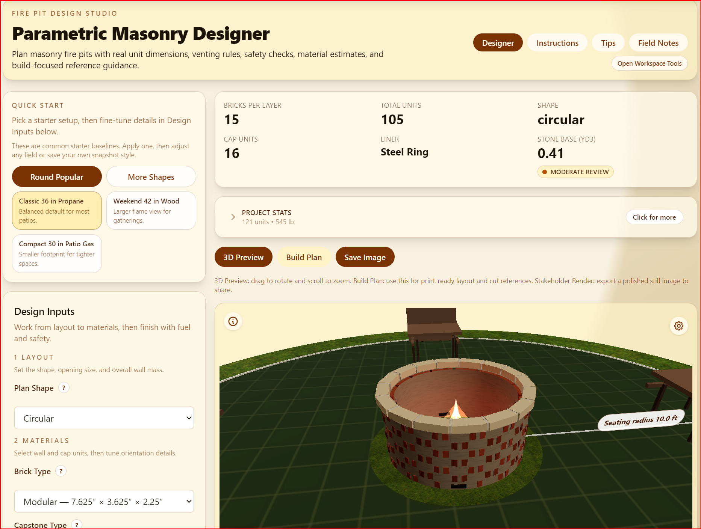

# Parametric Masonry Designer

React 19 application for engineering-accurate masonry firepit design with real-time calculations, safety warnings, and visual construction outputs.

## What This Site Is

Parametric Masonry Designer is a planning tool for designing a custom backyard firepit before buying materials or starting construction. It combines practical masonry rules, safety checks, and visual previews so you can move from "idea" to a build-ready plan with confidence.

You can use it to:

- Size a firepit by inner diameter and wall height.
- See realistic material counts and waste-adjusted purchase estimates.
- Review safety clearances and fuel-specific venting guidance.
- Visualize the build in both 3D and construction-oriented views.

## Why I Built It

This project started as a personal backyard upgrade idea. I wanted to build a firepit, but I also wanted to avoid guesswork around dimensions, brick counts, vent area, and base prep.

Instead of using rough napkin math, I built a tool that turns engineering formulas into a practical planning workflow. The result is a project that is both technically interesting and useful in the real world.

## Screenshot

## Current Capabilities

- Parametric circular, square, and rectangular firepit design.
- Engineering-aware wall, capstone, venting, liner, and foundation calculations.
- 3D preview with camera presets, cutaway mode, dimension overlays, LOD, and WebGL fallback handling.
- Construction Mode with printable layer-by-layer SVG guidance.
- Enhanced Bill of Materials with categorized material groups, cost estimator, and BOM-focused print layout.
- Professional Engineering Report generation (print-to-PDF flow).
- Project workspace with autosave, snapshots, import/export JSON, and side-by-side variant comparison.
- Regional advisory checks (setback, venting, frost-line/HOA context) and material/cost optimization suggestions.
- GLB model export for downstream Blender/Fusion-style workflows.

## Requirements

- Node.js 20+ recommended.
- npm 10+ recommended.
- Modern browser with WebGL support for 3D view and GLB export.

## Known Limitations

- Vertical clearance is advisory content only; the live safety diagram currently models horizontal clearance.
- Corner-overlap detailing for rectangular course interlock is still lighter than circular guidance.
- Double-wall cavity thermal assemblies are not yet modeled.

## Troubleshooting

- If the 3D scene does not render, verify WebGL is enabled and use the latest Chrome, Edge, or Firefox.
- If local autosave/snapshots appear missing, check browser storage settings and privacy extensions that block local storage.
- If tests fail after dependency updates, remove `node_modules` and lockfile cache, reinstall, then rerun `npm run test`.

## Build Workflow (Design To First Fire)

1. Define geometry: plan shape, inner size, wall height, wall/cap units, and mortar settings.
2. Set fuel + thermal strategy: wood, propane, or natural gas with liner/ring selection.
3. Validate safety + site context: horizontal setback, vent area/placement, and soil/drainage/frost advisory output.
4. Review quantities: units, waste-adjusted purchase count, mortar, cap count, and base stone volume.
5. Review Construction Mode and course output before any field layout starts.
6. Build foundation and wall system, then follow cure and first-fire guidance (28-day cure for mortared assemblies).

## Before You Build (Quick Checklist)

- Confirm local code/permit requirements and HOA constraints.
- Call utility locate services before excavation.
- Verify setbacks from combustibles and overhead hazards.
- Confirm fuel hardware requirements (burner/pan venting and cavity instructions for gas builds).
- Gather tools/PPE for measuring, layout, cutting, compaction, and masonry work.
- Plan weather window, drainage strategy, and curing time before first ignition.

## Limits And Assumptions

| Topic | Current behavior |
|---|---|
| Core sizing math | Engineering-based and enforced (unit geometry, joints, running bond, counts). |
| Horizontal clearance | Enforced warning when below 10 ft baseline. |
| Vertical clearance | Advisory only (not fully modeled in live diagram output). |
| Foundation sizing | Baseline quantity model fixed; soil/drainage/frost context is advisory. |
| Gas venting | Rule-based guidance and warnings; confirm exact manufacturer requirements. |
| Thermal assembly depth | Liner/ring modeled; advanced double-wall cavity behavior not yet modeled. |

## Field Validation Steps (On Site)

1. Dry-lay the first course and confirm fit before mortar or adhesive.
2. Verify vent positions/open area and keep vent paths unobstructed.
3. Re-check clearances in real site conditions (structures + overhead hazards).
4. Confirm liner/ring spacing and gas-line entry routing before final assembly.
5. Reconcile purchased materials against planned quantities before installation starts.
6. Complete curing and pre-ignition safety checks before first full fire.

## Recent UX Improvements

- Optional advanced tooling is now grouped under **Optional Insights** so the default designer view stays cleaner.
- Variant comparison is hidden by default and can be toggled on demand.
- Knowledge Center content is easier to scan:
  - quick topic index,
  - collapsible guidance sections,
  - searchable FAQ filter.

## What Is Next

Current roadmap priorities after the completed PDF + GLB + comparison work:

1. Multi-firepit site planning (place and evaluate multiple pits in one layout).
2. Additional CAD interoperability refinements (export options and workflow polish).
3. Optional AR/mobile preview phase (deferred by design for now).

## Phase 1: Engineering Math

### 1. Masonry Unit Dimensions and Jointing

Default modular brick dimensions (actual):

- Width: 3.625 in
- Height: 2.25 in
- Length: 7.625 in
- Mortar joint (default, configurable): 0.375 in

### 2. Circular Unit Count (Centerline Formula)

For circular courses we use:

$$
N = \frac{\pi \cdot (D - W)}{L + J}
$$

Where:

- $N$ = units per course
- $D$ = outer diameter of wall
- $W$ = wall thickness (unit width in stretcher orientation)
- $L$ = unit length
- $J$ = vertical mortar joint thickness

The UI input uses inner diameter. Therefore:

$$
D = D_{inner} + 2W
$$

and:

$$
N = \frac{\pi \cdot (D_{inner} + W)}{L + J}
$$

Example with 36 in inner diameter and modular brick with 3/8 in joints:

$$
N = \frac{\pi \cdot (36 + 3.625)}{7.625 + 0.375} \approx 15.56
$$

Rounded for full-unit planning (course-by-course) uses floor:

$$
N_{rounded} = 15
$$

### 3. Running Bond

Running bond is enforced as a 50% module offset every alternate course:

$$
\text{offset}_{course} =
\begin{cases}
0 & \text{if even course}\\
\frac{L + J}{2} & \text{if odd course}
\end{cases}
$$

### 4. Ventilation Logic

- Propane (heavier than air): vents at base courses.
- Natural gas (lighter than air): vents near top courses.
- Wood: base venting for combustion support.
- Total vent open area constrained to at least 18 sq in.

### 5. Foundation/Sub-Base Calculation

Foundation footprint diameter is 6 in wider on each side:

$$
D_{footprint} = D_{outer} + 12
$$

Stone depth fixed at 8 in:

$$
V = \pi \cdot \left(\frac{D_{footprint}}{2}\right)^2 \cdot 8
$$

with conversions:

$$
\text{ft}^3 = \frac{V}{1728}, \quad \text{yd}^3 = \frac{V}{46656}
$$

### 6. Safety Clearance Rule

If structure proximity is below 10 ft, show warning.

### 7. Logistics and Material Estimation

The engine also computes practical construction estimates:

- Brick purchase quantity with 15% waste factor.
- Estimated brick dead load using 4.5 lb per modular brick.
- Estimated stone mass using 100 lb/ft3 and 10% handling waste.
- Mortar estimate using 0.0175 ft3 per purchased brick (midpoint rule from 15-20 ft3 per 1000 bricks).

### 8. Capstone Overhang and Cap Course

Capstone overhang is user-defined per side. Cap outer diameter is:

$$
D_{cap,outer} = D_{outer} + 2 \cdot O
$$

Where $O$ is cap overhang in inches on each side.

Cap course units are calculated using the same centerline formula with cap diameter:

$$
N_{cap} = \frac{\pi \cdot (D_{cap,outer} - W)}{L + J}
$$

## Project Structure

- `src/engine/MasonryEngine.ts`: core engineering formulas and rules.
- `src/engine/__tests__/MasonryEngine.test.ts`: verification tests.
- `src/components/Stage3D.tsx`: @react-three/fiber 3D stage.
- `src/components/ConstructionMode.tsx`: SVG layer-by-layer build map.
- `src/components/BillOfMaterials.tsx`: enhanced BOM + cost estimator + print output.
- `src/components/ProjectComparisonPanel.tsx`: side-by-side snapshot variant analysis.
- `src/components/RegionalCodeChecker.tsx`: regional advisory checks.
- `src/components/MaterialOptimizationSuggestions.tsx`: optimization prompts.
- `firepit-research.md`: engineering baseline and expanded research notes.

## Run

1. `npm install`
2. `npm run dev`
3. `npm run test`
