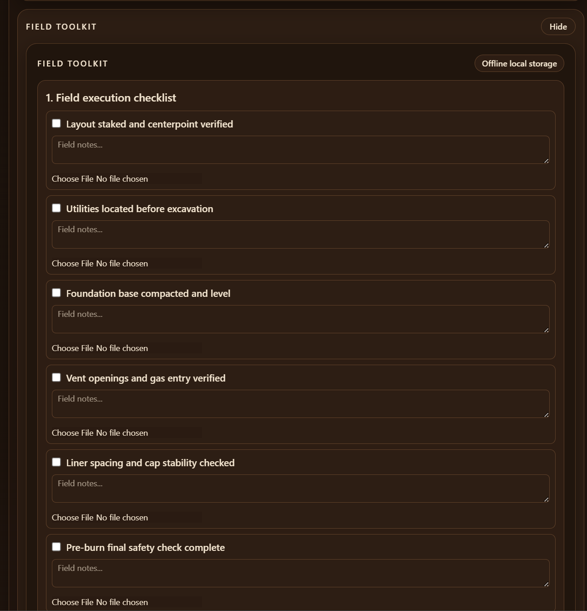
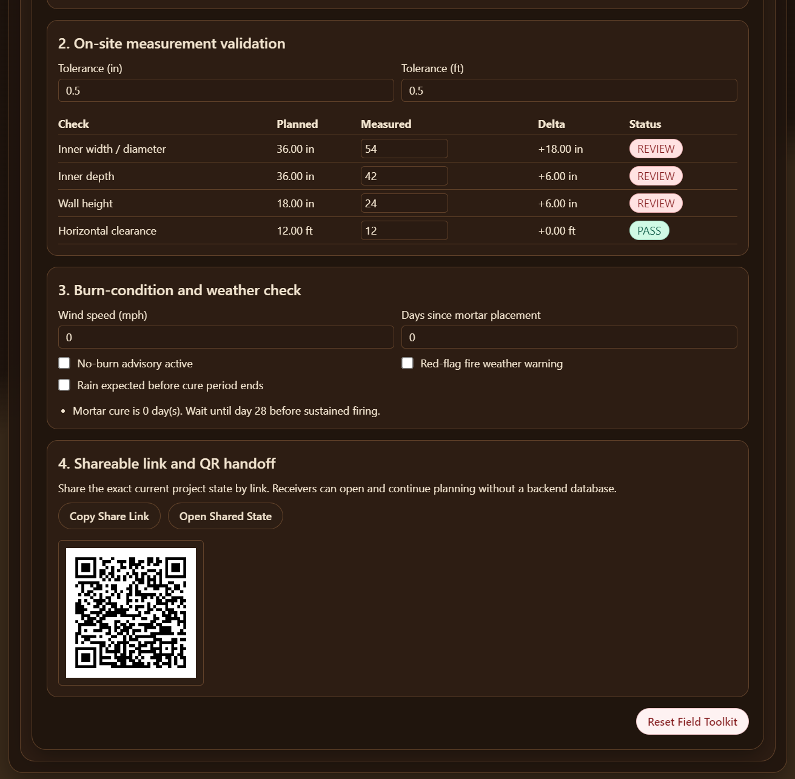
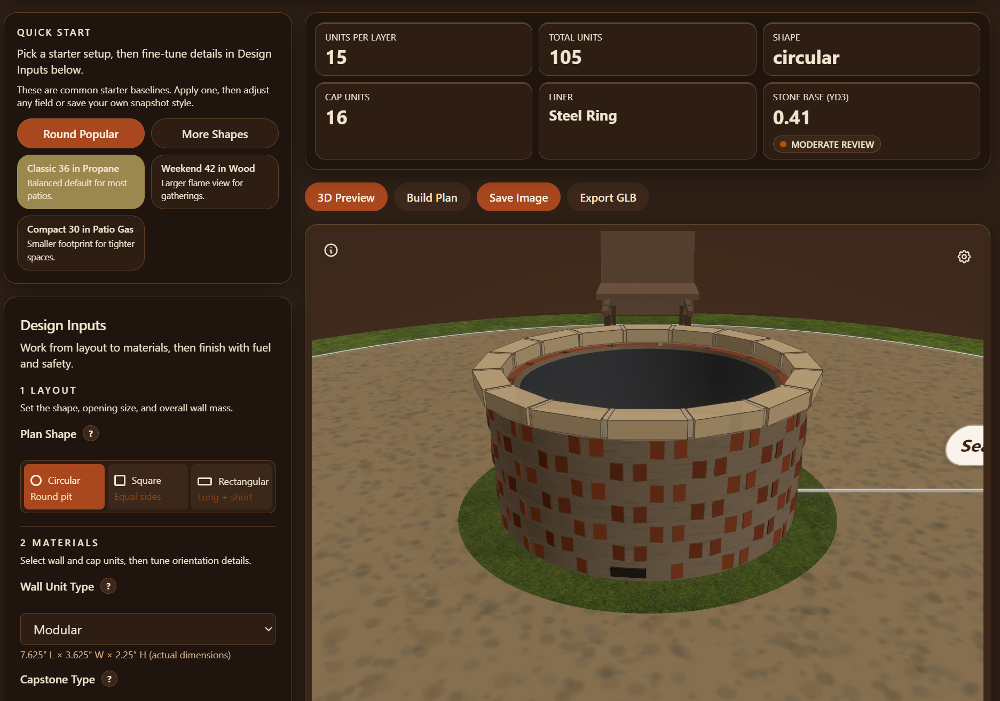

# Parametric Masonry Designer & Thermodynamic Firepit Studio

React 19 application for engineering-accurate masonry firepit design with real-time calculations, thermodynamic smokeless venting, commercial insert compatibility, safety warnings, and visual construction outputs.

## What This Site Is

Parametric Masonry Designer is a planning tool for designing a custom backyard firepit before buying materials or starting construction. It combines practical masonry rules, thermodynamic venting science, safety checks, and visual previews so you can move from "idea" to a build-ready plan with confidence.

You can use it to:

- Size a firepit by inner diameter and wall height across circular, square, rectangular, hexagonal, and octagonal shapes.
- Choose between single-wall, double-wall (thermal cavity), and smokeless secondary-combustion configurations.
- Select distinct materials for the inner firebox wall (heat-rated firebrick, refractory castable) and the outer decorative shell (natural stone, standard brick, CMU).
- Size and validate smokeless insert fitment for Solo Stove, Breeo, Tiki Brand, and custom DIY liners.
- Calculate draft pressure, intake/outlet vent ratio, and secondary combustion airflow requirements.
- See realistic material counts and waste-adjusted purchase estimates including split inner/outer wall quantities.
- Review safety clearances and fuel-specific venting guidance including flange overlap and base vent omission counts.
- Visualize the build in both 3D and construction-oriented views with PBR material shaders and optional cross-section cutaway.

## Why I Built It

This project started as a personal backyard upgrade idea. I wanted to build a firepit, but I also wanted to avoid guesswork around dimensions, brick counts, vent area, and base prep.

Instead of using rough napkin math, I built a tool that turns engineering formulas into a practical planning workflow. The result is a project that is both technically interesting and useful in the real world.

## Screenshot

## Additional Screenshots (Recommended)

Adding feature-focused screenshots will improve adoption and clarity. Suggested captures:

- `public/screenshots/field-toolkit.png` (checklist + measurements + weather checks)
- `public/screenshots/share-qr-handoff.png` (compact share link + QR handoff panel)
- `public/screenshots/dark-mode-designer.png` (dark-mode contrast and readability)

## Screenshot Gallery

> Add these files in `public/screenshots/` to enable the gallery previews below.

### Field Toolkit

### Share + QR Handoff

### Dark Mode Designer

## Current Capabilities

- Parametric circular, square, and rectangular firepit design.
- Engineering-aware wall, capstone, venting, liner, and foundation calculations.
- 3D preview with camera presets, cutaway mode, dimension overlays, LOD, and WebGL fallback handling.
- Construction Mode with printable layer-by-layer SVG guidance.
- Enhanced Bill of Materials with categorized material groups, cost estimator, and BOM-focused print layout.
- Double-wall cavity planning with outer-shell counts, cap-bridge row schedule, closure-unit estimates, and 3D multi-row cap preview.
- Professional Engineering Report generation (print-to-PDF flow).
- Project workspace with autosave, snapshots, import/export JSON, and side-by-side variant comparison.
- Regional advisory checks (setback, venting, frost-line/HOA context) and material/cost optimization suggestions.
- GLB model export for downstream Blender/Fusion-style workflows.
- Vertical + horizontal safety visualization including overhead-clearance review.
- Gas hardware templates (generic, drop-in pan, linear, high-BTU) that tune vent-area guidance.
- Rectangular/square corner interlock guidance and permit/inspection checklist output in build packet.
- Field Toolkit for no-DB field workflows (progress checklist, notes/photos, measurement validation, weather checks).
- Shareable compact URL + QR project handoff, with backward compatibility for older share links.
- Offline-first basics via manifest + service worker app-shell caching (PWA-style behavior).

## Known Limitations (Active Development Gaps)

The following capabilities are identified and on the roadmap but not yet implemented:

| Gap | Description |
|---|---|
| **Separate inner/outer wall materials** | Double-wall mode currently uses the same material for both shells. Distinct inner (firebrick/refractory) and outer (stone/brick) materials with split BOM are planned. |
| **Smokeless secondary-combustion mode** | Stack-effect draft pressure, intake/outlet vent ratio, and secondary jet sizing are not yet modeled. `thermalCavityVentMode` is a cavity behavior flag, not a smokeless system. |
| **Commercial insert fitment** | Solo Stove, Breeo, and Tiki Brand insert profiles with flange overlap checks and auto-omit base-course block counts are planned. |
| **Mortar type distinction** | Refractory mortar (firebox zone) vs. Type N/S (outer wall) are not yet tracked separately. |
| **Hex/octagonal shapes** | Only circular, square, and rectangular plans are currently supported. |
| **Keyhole firepit shape** | Cooking-focused keyhole (circle + coal channel) shape is not yet available. |
| **In-ground / raised-pedestal build modes** | All builds are modeled as above-grade masonry walls. |
| **Ash cleanout features** | Hinged cleanout door, removable ash pan, and drain hole options are not yet modeled. |
| **PBR 3D materials** | 3D renderer uses flat colors; PBR roughness/metalness shaders for firebrick, natural stone, stainless, and Corten steel are planned. |
| **Airflow particle simulation** | Animated convective airflow visualization (cold intake → heated cavity → secondary jets) is planned for smokeless mode. |

## Requirements

- Node.js 20+ recommended.
- npm 10+ recommended.
- Modern browser with WebGL support for 3D view and GLB export.

## Known Limitations

- Advanced heat-transfer simulation is still first-pass/rule-based (not transient CFD/FEA).
- Manufacturer-specific gas hardware SKU compliance is still template-based, not model/SKU exact.
- Offline support currently focuses on app-shell and cached assets; full offline map/weather/code integrations are not included.

## Troubleshooting

- If the 3D scene does not render, verify WebGL is enabled and use the latest Chrome, Edge, or Firefox.
- If local autosave/snapshots appear missing, check browser storage settings and privacy extensions that block local storage.
- If a QR code does not scan, regenerate from the Field Toolkit (new compact links scan more reliably than older long payload links).
- If shared links do not restore state, confirm the full query string is preserved when copied/pasted.
- If tests fail after dependency updates, remove `node_modules` and lockfile cache, reinstall, then rerun `npm run test`.

## Build Workflow (Design To First Fire)

1. Define geometry: plan shape (circular/square/rectangular/hexagonal/octagonal), inner size, wall height, wall/cap units, and mortar settings.
2. Set fuel + thermal strategy: wood, propane, or natural gas with single-wall, double-wall, or smokeless secondary-combustion liner selection.
3. If smokeless mode: choose commercial insert preset (Solo Stove, Breeo, Tiki) or enter custom DIY dimensions; tool calculates required masonry ID, air gap, flange overlap, and base-course vent omissions.
4. Validate safety + site context: horizontal setback, vent area/placement, soil/drainage/frost advisory output, and flange overlap status.
5. Review quantities: units, waste-adjusted purchase count, mortar by zone (refractory/standard), cap count, cap-bridge row schedule (if double-wall), and base stone volume.
6. Review Construction Mode, permit checklist output, and course-level guidance before field layout starts.
7. Use Field Toolkit during install for checklist progress, measured-vs-planned tolerance checks, and weather/burn gating.
8. Build foundation and wall system, then follow cure and first-fire guidance (28-day cure for mortared assemblies).

## Before You Build (Quick Checklist)

- Confirm local code/permit requirements and HOA constraints.
- Call utility locate services before excavation.
- Verify setbacks from combustibles and overhead hazards.
- Confirm fuel hardware requirements (burner/pan venting and cavity instructions for gas builds).
- Gather tools/PPE for measuring, layout, cutting, compaction, and masonry work.
- Plan weather window, drainage strategy, and curing time before first ignition.

## Limits And Assumptions

| Topic | Current behavior |
|---|---|
| Core sizing math | Engineering-based and enforced (unit geometry, joints, running bond, counts). |
| Horizontal clearance | Enforced warning when below 10 ft baseline. |
| Vertical clearance | Modeled in safety visualization inset with review warning below recommended baseline. |
| Foundation sizing | Baseline quantity model fixed; soil/drainage/frost context is advisory. |
| Gas venting | Rule-based guidance using fuel + hardware template ranges; confirm exact manufacturer requirements. |
| Thermal assembly depth | Double-wall cavity depth and cap-bridge row/closure planning are modeled; thermal behavior remains rule-based. |
| Inner/outer wall materials | **Currently same material for both shells.** Separate inner (firebrick) / outer (stone) with split BOM is planned (Phase 1). |
| Smokeless venting | **Not yet modeled.** `thermalCavityVentMode: 'vented'` is a cavity behavior flag, not a secondary-combustion system. Full stack-effect calc is Phase 1. |
| Commercial insert fitment | **Not yet modeled.** Solo Stove / Breeo / Tiki profiles with flange overlap check are Phase 1. |
| Plan shapes | Circular, square, rectangular only. Hex/octagonal planned for Phase 2. |
| Build modes | Above-grade masonry only. In-ground and raised-pedestal modes planned for Phase 2. |
| 3D materials | Flat colors only. PBR shaders and cross-section cutaway planned for Phase 3. |

## Field Validation Steps (On Site)

1. Dry-lay the first course and confirm fit before mortar or adhesive.
2. Verify vent positions/open area and keep vent paths unobstructed.
3. Re-check clearances in real site conditions (structures + overhead hazards).
4. Confirm liner/ring spacing and gas-line entry routing before final assembly.
5. Reconcile purchased materials against planned quantities before installation starts.
6. Complete curing and pre-ignition safety checks before first full fire.

## Recent UX Improvements

- Optional advanced tooling is now grouped under **Optional Insights** so the default designer view stays cleaner.
- Variant comparison is hidden by default and can be toggled on demand.
- Knowledge Center content is easier to scan:
  - quick topic index,
  - collapsible guidance sections,
  - searchable FAQ filter.

## What Is Next

Current roadmap priorities:

### Phase 1 — Thermodynamic Engine Integration (Highest Impact)

1. **Separate inner/outer wall materials** — Allow distinct `innerWallPresetKey` and `outerWallPresetKey` in double-wall mode. Inner: firebrick, refractory castable, high-alumina. Outer: natural stone, standard brick, CMU. Separate mortar type per zone (refractory vs. Type N/S). Split BOM line items.
2. **Smokeless secondary-combustion mode** — Add `smokelessMode` flag that enables stack-effect draft pressure calculation, intake/outlet vent area ratio enforcement, and secondary jet sizing. Works with both double-wall AND single-wall + steel ring liner.
3. **Commercial insert preset database** — Pre-configured fitment profiles for Solo Stove Bonfire 2.0, Breeo X19/X24/X30, Tiki Brand Patio, and custom DIY. Auto-calculates required masonry ID, flange overlap status, and base-course vent omission count.

### Phase 2 — Shape and Configuration Expansion

4. **Hexagonal and octagonal plan shapes** — New `PlanShape` variants with corner-count-based perimeter math, corner interlock guidance, and 3D rendering.
5. **Keyhole firepit shape** — Circle + rectangular cooking channel for coal-rake cooking configurations.
6. **In-ground and raised-pedestal build modes** — In-ground mode changes foundation from slab to excavation + drainage pocket + gravel fill calc.
7. **Ash cleanout features** — Hinged cleanout door, removable ash pan, or drain holes; affects first-course layout and BOM.

### Phase 3 — Visualizer and Rendering Upgrades

8. **PBR material shaders** — MeshStandardMaterial with per-material roughness/metalness: firebrick (rough 0.9), natural stone (rough 0.85–0.95), brushed stainless (metalness 1.0, rough 0.2), Corten steel (metalness 0.2, rough 0.75 + rust tint).
9. **Cross-sectional cutaway tool** — WebGL clipping plane toggle revealing annular air gap width, insert flange resting on cap, and gravel foundation layers.
10. **Convective airflow particle simulation** — GPU particle system for smokeless mode: blue particles entering base vents → transitioning to red as they rise through the cavity → high-velocity jets from top rim holes.

### Deferred / Future Consideration

- Multi-firepit site planning (place multiple pits in one layout).
- Rocket stove and Dakota fire hole configurations.
- AR/mobile preview phase.
- CAD interoperability refinements.

## Double-Wall Material Pairings

In double-wall mode, the inner and outer shells serve fundamentally different roles and should use different materials:

| Zone | Material Options | Temp Rating | Mortar Type |
|---|---|---|---|
| **Inner firebox wall** | Standard firebrick | 1,800–2,000°F | Refractory (fireclay) mortar |
| **Inner firebox wall** | Refractory castable concrete | 2,000–2,500°F | N/A (poured) |
| **Inner firebox wall** | High-alumina firebrick | Up to 3,000°F | High-temp refractory mortar |
| **Outer decorative shell** | Natural stone (granite, basalt) | Excellent radiant tolerance | Type N or Type S masonry mortar |
| **Outer decorative shell** | Standard clay brick | Good | Type N or Type S masonry mortar |
| **Outer decorative shell** | CMU / concrete block | Structural base only | Type S masonry mortar |
| **Outer decorative shell** | Flagstone / pavers | Decorative facing | Type N masonry mortar |

**Important:** Never use regular Portland cement mortar in the firebox zone — it degrades above ~572°F (300°C) and will crack under thermal cycling. Refractory mortar contains alumina and silica to withstand 2,000°F+ continuously.

**Stones to avoid near direct heat:** River rock, sandstone, limestone, and shale contain trapped moisture or chemically decompose at fire temperatures and can spall explosively.

## Smokeless Firepit Science

### How Secondary Combustion Works

A smokeless wood-burning firepit operates as a double-wall convective heat exchanger. The physics rely on three sequential stages:

1. **Primary combustion** — Wood burns in the inner chamber, releasing heat, CO, hydrogen, VOCs, and water vapor. Below ~600°F, these unburned gases escape as visible smoke.
2. **Air pre-heating (stack effect)** — Cool ambient air enters through base-level intake vents, travels upward through the annular cavity between the inner and outer walls, and is heated to 600–900°F by conduction and radiation from the inner wall. The driving draft pressure is:

$$\Delta P = P_{\text{atm}} \cdot \frac{g \cdot H}{R} \cdot \left(\frac{1}{T_0} - \frac{1}{T_i}\right)$$

Where $P_{\text{atm}}$ is atmospheric pressure (Pa), $g$ = 9.81 m/s², $H$ is cavity height (m), $R$ = 287.05 J/kg·K, $T_0$ is ambient temperature (K), and $T_i$ is cavity air temperature (K).

3. **Secondary combustion (re-burn)** — Superheated air is injected through a ring of small holes at the top inner rim of the firebox. The concentrated jets of hot, oxygen-rich air ignite the rising unburned gases a second time, burning off most visible smoke before it escapes.

### Intake / Outlet Vent Area Ratio

To prevent either air starvation (too-rich burn) or thermal choking (excessive cold air cooling the cavity), the ratio of total base intake area to total secondary jet area must satisfy:

$$1.2 \leq \frac{A_{\text{intake}}}{A_{\text{holes}}} \leq 1.5$$

If the ratio falls below 1.2, the system starves for oxygen and secondary combustion stalls. If it exceeds 1.5, excessive cold air enters and cools cavity temperature below the re-ignition threshold (~600°F / 315°C).

### Vent Sizing Reference

| Parameter | Typical Value | Notes |
|---|---|---|
| Bottom intake hole diameter | ¾ in (19 mm) | Primary air; 16–24 holes evenly spaced |
| Bottom intake height from base | 1–2 in above floor | Low enough for draft; allows ash clearance |
| Top secondary jet diameter | ½ in (12 mm) | Smaller for jet velocity; 16–24 holes |
| Top secondary jet height | 1–2 in below inner rim | Must inject into combustion zone, not above |
| Annular air gap width | ½–1½ in; optimal ~1 in | < ¾ in restricts flow; > 1½ in reduces preheat |
| Minimum wall height for smokeless | 12 in | Taller = stronger stack draft |

### Single-Wall Smokeless (Steel Ring Liner)

A smokeless design also works with a single outer wall and a steel ring liner — the liner and wall form the annular cavity. Requirements:
- Liner diameter 1–2 in smaller than masonry inner diameter (½–1 in gap around circumference)
- Steel liner thickness: 1/16 in–1/8 in (1.5–3 mm)
- Secondary holes (⅜–½ in dia.) drilled at top rim of liner
- Elevated grate to allow underfire primary airflow
- Base intake vents through the outer masonry wall

This configuration is less efficient than a full double-wall design (shorter preheat path, less insulated cavity) but is a practical upgrade to a standard single-wall pit using an off-the-shelf steel ring.

## Commercial Smokeless Insert Compatibility

When using a commercial smokeless insert, the masonry inner diameter must be sized to provide the correct air gap around the insert base, and the insert flange must overlap the inner wall edge by at least 1 in:

$$D_{\text{masonry}} = D_{\text{base}} + 2 \cdot G_{\text{air}}$$

$$D_{\text{flange}} \geq D_{\text{masonry}} + 1.0 \text{ in}$$

| Insert Model | Base OD | Flange OD | Min Pit Depth | Air Gap | Required Masonry ID |
|---|---|---|---|---|---|
| Solo Stove Bonfire 2.0 | 19.50 in | 21.50 in | 14.50 in | 0.75 in | 21.00 in |
| Breeo X19 | 19.00 in | 22.00 in | 15.00 in | 1.50 in | 22.00 in |
| Breeo X24 | 24.00 in | 27.50 in | 15.00 in | 1.50 in | 27.00 in |
| Breeo X30 | 30.00 in | 34.00 in | 15.00 in | 2.00 in | 34.00 in |
| Tiki Brand Patio Smokeless | 24.75 in | 26.75 in | 18.75 in | 1.00 in | 26.75 in |
| Custom DIY Steel Liner | D_liner | D_liner + 2×lip | 12–18 in | 0.50–1.00 in | D_liner + 2×G_air |

**Flange overlap safety check:** If the insert flange OD ≤ masonry inner edge + 0.25 in → `unsafe_falling_risk`. If flange OD < masonry inner edge + 1.0 in → `marginal_slip_risk`.

## Firepit Type Reference

| Type | Description | Key Design Feature |
|---|---|---|
| **Standard masonry firepit** | Above-grade mortared or dry-stack ring | Most common DIY permanent build |
| **Double-wall smokeless** | Inner + outer masonry wall with air cavity | Secondary combustion; low smoke |
| **Single-wall + smokeless insert** | Standard outer wall + commercial or DIY steel liner | Retrofit smokeless upgrade |
| **Keyhole firepit** | Circle + teardrop cooking channel | Coal-rake zone for Dutch oven / skillet cooking |
| **In-ground firepit** | Dug below grade; no visible wall | Wind-protected; drainage-critical |
| **Raised pedestal** | Column-supported bowl | Modern/sculptural; usually gas |
| **Fire ring (primitive)** | Metal ring only, no masonry | Portable; campsite style |
| **Fire bowl** | Bowl-shaped vessel (steel, corten, copper) | Portable or pedestal; modern aesthetic |
| **Fire table** | Flat surface surrounding gas burner | Patio furniture integration; usually propane |
| **Rocket stove** | L/J-shaped combustion chamber | High efficiency; very low smoke; cook-focused |
| **Dakota fire hole** | Two underground connected chambers | Near-smokeless; survival/field technique |
| **Swirl / vortex pit** | Tangentially angled air inlets | Spiraling flame effect; burns hotter |

## Phase 1: Engineering Math

### 1. Masonry Unit Dimensions and Jointing

Default modular brick dimensions (actual):

- Width: 3.625 in
- Height: 2.25 in
- Length: 7.625 in
- Mortar joint (default, configurable): 0.375 in

### 2. Circular Unit Count (Centerline Formula)

For circular courses we use:

$$
N = \frac{\pi \cdot (D - W)}{L + J}
$$

Where:

- $N$ = units per course
- $D$ = outer diameter of wall
- $W$ = wall thickness (unit width in stretcher orientation)
- $L$ = unit length
- $J$ = vertical mortar joint thickness

The UI input uses inner diameter. Therefore:

$$
D = D_{inner} + 2W
$$

and:

$$
N = \frac{\pi \cdot (D_{inner} + W)}{L + J}
$$

Example with 36 in inner diameter and modular brick with 3/8 in joints:

$$
N = \frac{\pi \cdot (36 + 3.625)}{7.625 + 0.375} \approx 15.56
$$

Rounded for full-unit planning (course-by-course) uses floor:

$$
N_{rounded} = 15
$$

### 3. Running Bond

Running bond is enforced as a 50% module offset every alternate course:

$$
\text{offset}_{course} =
\begin{cases}
0 & \text{if even course}\\
\frac{L + J}{2} & \text{if odd course}
\end{cases}
$$

### 4. Ventilation Logic

- Propane (heavier than air): vents at base courses.
- Natural gas (lighter than air): vents near top courses.
- Wood: base venting for combustion support.
- Total vent open area constrained to at least 18 sq in.

### 5. Foundation/Sub-Base Calculation

Foundation footprint diameter is 6 in wider on each side:

$$
D_{footprint} = D_{outer} + 12
$$

Stone depth fixed at 8 in:

$$
V = \pi \cdot \left(\frac{D_{footprint}}{2}\right)^2 \cdot 8
$$

with conversions:

$$
\text{ft}^3 = \frac{V}{1728}, \quad \text{yd}^3 = \frac{V}{46656}
$$

### 6. Safety Clearance Rule

If structure proximity is below 10 ft, show warning.

### 7. Logistics and Material Estimation

The engine also computes practical construction estimates:

- Brick purchase quantity with 15% waste factor.
- Estimated brick dead load using 4.5 lb per modular brick.
- Estimated stone mass using 100 lb/ft3 and 10% handling waste.
- Mortar estimate using 0.0175 ft3 per purchased brick (midpoint rule from 15-20 ft3 per 1000 bricks).

### 8. Capstone Overhang and Cap Course

Capstone overhang is user-defined per side. Cap outer diameter is:

$$
D_{cap,outer} = D_{outer} + 2 \cdot O
$$

Where $O$ is cap overhang in inches on each side.

Cap course units are calculated using the same centerline formula with cap diameter:

$$
N_{cap} = \frac{\pi \cdot (D_{cap,outer} - W)}{L + J}
$$

## Project Structure

- `src/engine/MasonryEngine.ts`: core engineering formulas and rules.
- `src/engine/__tests__/MasonryEngine.test.ts`: verification tests.
- `src/components/Stage3D.tsx`: @react-three/fiber 3D stage.
- `src/components/ConstructionMode.tsx`: SVG layer-by-layer build map.
- `src/components/BillOfMaterials.tsx`: enhanced BOM + cost estimator + print output.
- `src/components/ProjectComparisonPanel.tsx`: side-by-side snapshot variant analysis.
- `src/components/RegionalCodeChecker.tsx`: regional advisory checks.
- `src/components/MaterialOptimizationSuggestions.tsx`: optimization prompts.
- `firepit-research.md`: engineering baseline and expanded research notes.

## Run

1. `npm install`
2. `npm run dev`
3. `npm run test`
