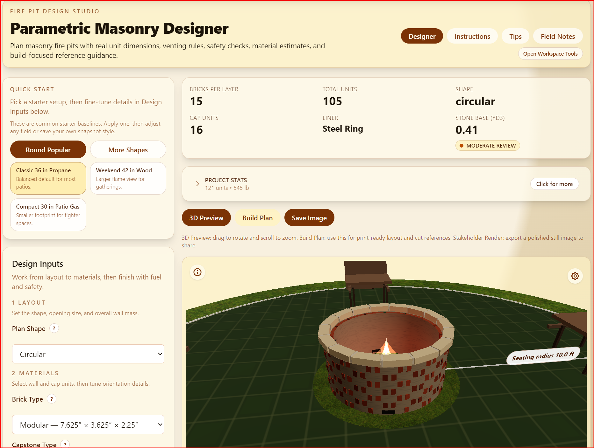
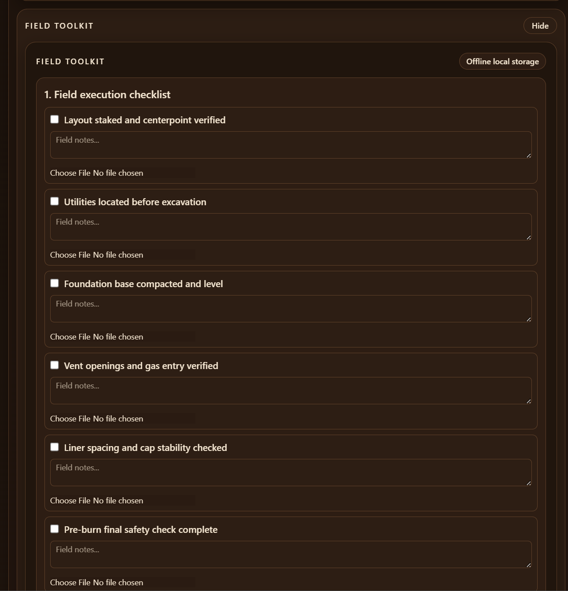
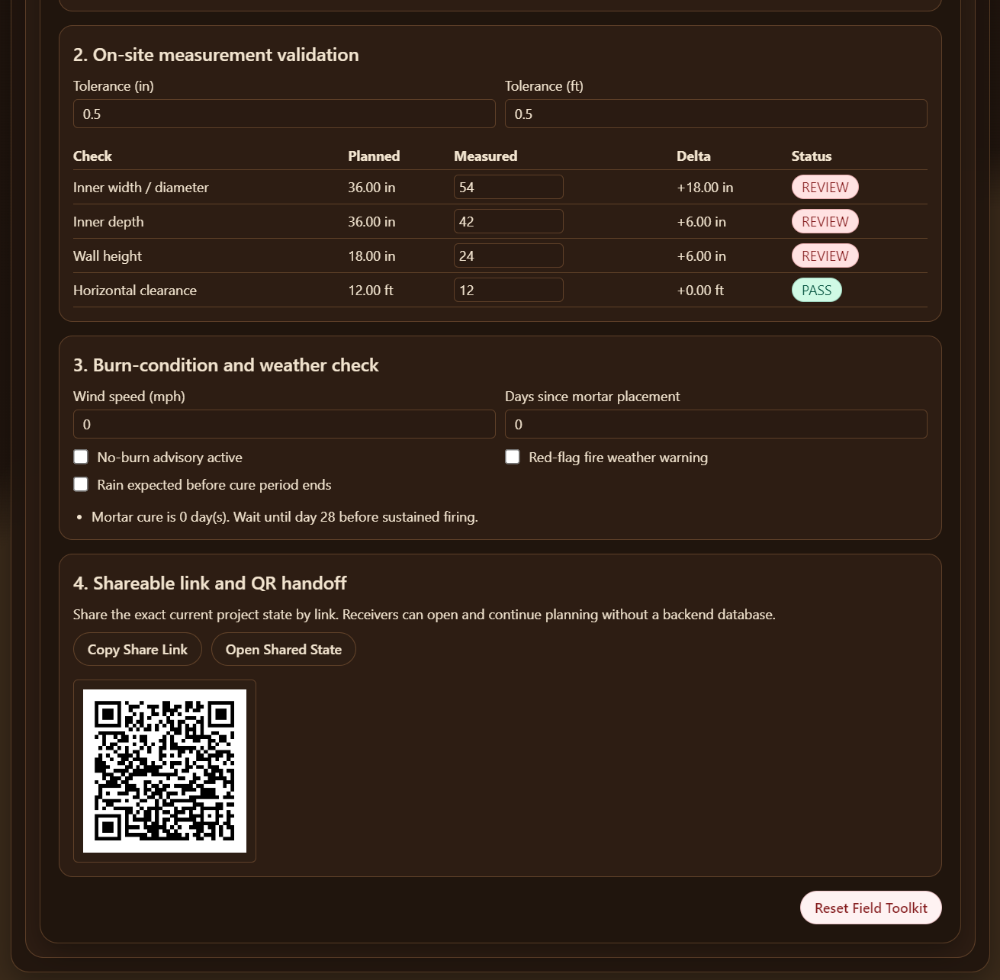
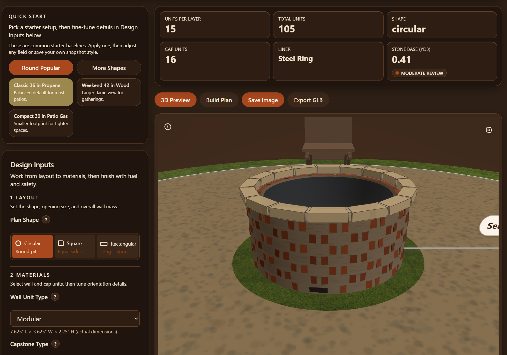

# Parametric Masonry Designer

React 19 app for exploring masonry fire-pit geometry, quantities, layouts, and site-review questions. **This is a planning tool.** Its outputs are not approved construction drawings, an equipment installation manual, or a code determination.

## What it does

- Models circular, square, rectangular, hexagonal, and octagonal wall courses with configurable units, joints, caps, and cut strategies.
- Estimates unit counts, selected material quantities, cost, and an illustrative stone-base volume.
- Displays a 3D preview, course diagrams, a construction planning packet, and a printable design planning report.
- Saves projects locally, supports snapshots and JSON import/export, and generates share links and QR codes in the browser.
- Prompts review of combustibles, materials, foundation conditions, gas venting, and first-fire procedures.
- Provides a DIY smokeless-liner sketch with modeled hole areas and idealized draft. It has **not** been validated for fabrication or combustion performance.

## Current engineering limits

The [assumption and evidence register](ENGINEERING_ASSUMPTIONS.md) tracks each construction-relevant number, its source status, and the remaining review. In particular:

- The 10 ft combustible clearance is [U.S. Fire Administration general advice](https://www.usfa.fema.gov/prevention/outdoor-fires/). Product instructions and local requirements can be stricter.
- The app estimates gas vent geometry but cannot confirm required free opening per side, placement, or equipment compatibility without the exact burner and enclosure manuals. Every gas design is flagged for product-specific review; old generic category selections are ignored.
- Generic planning remains available. Source-linked starter profiles cover [Breeo X19/X24/X30 with its X Series Insert Ring](https://breeo.com/products/x-series-insert-ring) and the [American Fire Glass Match Light Kit manual](https://americanfireglass.com/media/manual/Match%20Light%20Kits.pdf). These profiles check only entered geometry that the app can know. They do not verify the installed product, free vent area, surround depth, or site approval.
- Generic brick and stone names do not establish a temperature rating. Double-wall fireboxes require product datasheets and assembly review.
- The 8 in stone base and 6 in extension per side are quantity assumptions, not a foundation or frost-footing design.
- Earlier fabricated flange dimensions for branded smokeless pits were removed. Breeo X Series selections now show only documented surround opening ranges and require a separate depth and installation review. Legacy Solo Stove and TIKI selections remain unsupported and produce no fit geometry.
- DIY smokeless area ratios, hole placement, and draft estimates are unvalidated model outputs. Do not fabricate or fire from the generated sketch without independent review and testing.

## Calculation outline

The engine uses actual entered unit dimensions and joints. For a circular course, it estimates the raw count as centerline circumference divided by the unit module length:

```text
raw units = π × (inner diameter + wall thickness) / (unit length + joint)
```

For regular hexagonal and octagonal plans, perimeter uses `n × span × tan(π/n)`, where `span` is the modeled across-flats width. Square and rectangular plans use `2 × (width + depth)`. The outer perimeter also drives natural-stone face-area estimates. Course counts, cuts, and purchased quantities need confirmation with a measured dry lay and selected products.

The base-stone volume uses the modeled footprint area times an 8 in depth. Soil bearing, drainage, frost, and structural support are outside that volume formula.

## Run and verify

Requires Node.js 20+ and npm 10+.

```bash
npm install
npm run dev
npm run test
npm run build
```

The 3D preview requires WebGL. The remaining planner and exports can be used when WebGL is unavailable.

### Browser release checks

The browser suite checks autosave, project JSON round-trip, planning-packet export, and phone-width preview controls. Install Chrome locally, then run:

```bash
npm run test:e2e
```

The checked-in GitHub Actions quality gate runs the unit suite, production build, production-dependency audit, and browser suite on every push and pull request. CI installs its own Chromium browser. A passing local run does not verify the deployed Vercel version; review the preview deployment before promotion.

## Review before construction

1. Select actual wall, cap, liner, mortar, and fuel-system products; gather current manuals and datasheets.
2. Confirm the site and applicable local requirements, including utilities, combustibles, overhead conditions, soil, drainage, and frost.
3. Dry-lay representative courses and reconcile dimensions, cuts, joints, quantities, and support details.
4. Have gas work, firebox materials, foundation design, and any custom smokeless fabrication reviewed by appropriately qualified people.
5. Follow the selected products' installation, curing, and first-fire instructions.

## Project structure

- `src/engine/MasonryEngine.ts`: geometry and quantity model plus planning warnings.
- `src/engine/__tests__/MasonryEngine.test.ts`: engine examples and regression tests.
- `src/components/Stage3D.tsx`: interactive 3D preview.
- `src/components/ConstructionMode.tsx`: course diagrams and planning packet.
- `src/components/BillOfMaterials.tsx`: quantities and editable cost estimates.
- `src/utils/constructionPacket.ts`: exported diagrams and planning report.
- `ENGINEERING_ASSUMPTIONS.md`: source and validation status for construction-relevant assumptions.
- `PROJECT_AUDIT_2026-09-24.md`: audit findings and remediation history.

## Screenshots








